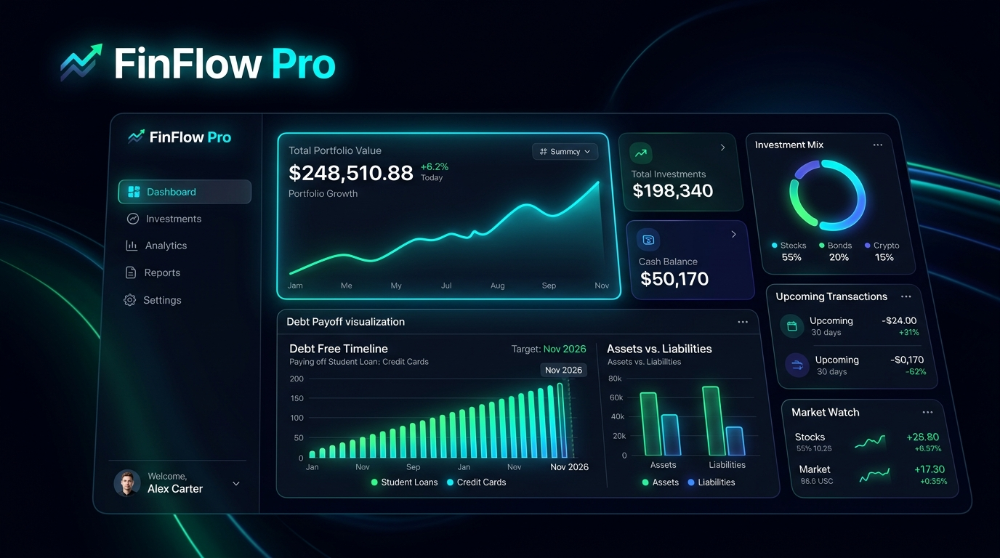

<div align="center">

  

  <br/><br/>

  # ⚡ ParaPusula Pro
  ### Yeni Nesil Siber-Neon Borç Kapatma, Nakit Akışı ve Portföy Yönetim Paneli

  <p align="center">
    <strong>%100 Gizlilik Odaklı (Local-First) • Sıfır Sunucu • Gelişmiş Excel İçe Aktarma • PWA Uyumlu</strong>
  </p>

  <p align="center">
    <a href="https://github.com/SULUNCAWAY_PARAPUSULA_TEMP/stargazers"></a>
    <a href="https://github.com/SULUNCAWAY_PARAPUSULA_TEMP/network/members"></a>
    <a href="https://github.com/SULUNCAWAY_PARAPUSULA_TEMP/blob/main/LICENSE"></a>
    
    
    
  </p>

  <p align="center">
    <a href="#-canlı-demo">🌐 Canlı Demo</a> •
    <a href="#-öne-çıkan-özellikler">✨ Özellikler</a> •
    <a href="#-akıllı-excel-içe-aktarma-motoru">📊 Akıllı Excel Motoru</a> •
    <a href="#-çığ-avalanche-borç-kapatma-motoru">🏔️ Çığ Simülatörü</a> •
    <a href="#-kurulum-ve-kullanım">🚀 Kurulum</a> •
    <a href="#-güvenlik-ve-gizlilik">🔐 Gizlilik</a>
  </p>

</div>

---

## 💡 Neden ParaPusula Pro?

Geleneksel bütçe uygulamaları ya banka giriş şifrelerinizi talep eder ya da verilerinizi uzak sunucularda saklar. Üstelik Türkiye'deki bankacılık dinamiklerini (kredi kartı asgari tutar kademeleri, KMH bileşik faizleri, KKDF + BSMV kesintileri) dikkate almazlar.

**ParaPusula Pro**, finansal özgürlüğe ulaşmanız için tasarlanmış bağımsız, açık kaynaklı ve **sıfır sunuculu (serverless)** bir finansal yönetim kokpitidir:

* 🛡️ **Banka Şifresi Yok, Üyelik Yok:** Hiçbir kişisel veri veya banka giriş bilgisi istenmez.
* 🔒 **Verileriniz Yalnızca Sizin Cihazınızda:** Tüm portföy tarayıcınızın yerel depolama alanında (`localStorage`) güvenle saklanır.
* 🇹🇷 **Türkiye Bankacılık Kurallarına %100 Uyum:** 25.000 ₺ üzeri limitlerde %40, altındaki limitlerde %20 asgari ödeme eşiği ve KMH günlük faiz simülasyonu.
* 🤖 **Yapay Zeka Destekli OCR & Finans Danışmanı:** Findeks PDF raporlarınızı veya mobil bankacılık ekran görüntülerinizi otomatik tarar, borçları tanır ve size özel tasarruf stratejileri önerir.

---

## 🌟 Canlı Demo

ParaPusula Pro'yu herhangi bir kurulum yapmadan doğrudan tarayıcınızda deneyimleyebilirsiniz:

👉 **[ParaPusula Pro'yu Canlı Kullanın](https://SULUNCAWAY_GITHUB_IO_PARAPUSULA_TEMP/)**

> [!TIP]
> ParaPusula Pro bir **PWA (Progressive Web App)**'tir. Telefonunuzun veya bilgisayarınızın tarayıcısından *"Ana Ekrana Ekle"* ya da *"Uygulamayı Yükle"* butonuna tıklayarak internetsiz dahi çalışan tam bir mobil/masaüstü uygulama gibi kullanabilirsiniz.

---

## ✨ Öne Çıkan Özellikler

### 1. 📊 Finansal Kokpit & Akıllı Metrikler (KPIs)
* **Aylık Toplam Gelir & Düzenli Giderler:** Maaş, ek gelirler ve kira, fatura, dijital abonelik takibi.
* **Aylık Zorunlu Çıkış:** Sabit giderler + kredi kartı asgarileri + kredi taksitleri + KMH faizlerinin toplam anlık yükü.
* **Serbest Nakit (Free Cash Flow):** Zorunlu ödemeler sonrası yatırım veya borç kapatmaya ayrılabilecek net serbest bütçe.
* **Borç Karşılama Oranı:** Dinamik Chart.js halka grafiği ile gelirinizin ne kadarının borç ve giderlere gittiğini renk kodlu izleyin.

### 2. 💳 Çok Boyutlu Borç & Portföy Yönetimi
* 💳 **Kredi Kartları:** Limit doluluk oranı, güncel dönem borcu, asgari ödeme tutarı ve son ödeme gününe kalan süre sayacı.
* 🏦 **KMH / Ek Hesaplar:** Kullanılan bakiye, aylık faiz yükü ve anlık risk durumu.
* 📝 **Taksitli Krediler:** Anapara ve faiz ayrıştırması, kalan taksit sayısı ve vade günleri.
* 💸 **Kısmi Ödeme (Partial Pay) Modu:** Borcun tamamını kapatamasanız bile yaptığınız ara ödemeleri tek tıkla düşebilme imkanı.

### 3. 📊 Akıllı Excel & CSV İçe Aktarma Motoru
* 📑 **Bütüncül Hata Denetimi:** Sayı, tarih ve tutar sütunlarındaki boşluk, virgül/nokta karışıklıkları (`1.250,50 TL`), `₺` simgeleri ve tırnak işaretlerini otomatik temizleyerek sıfır hatayla içe aktarır.
* 🔍 **Esnek Kolon Eşleme (Fuzzy Matcher):** Farklı bankaların (Garanti, İş Bankası, Yapı Kredi, Akbank vb.) farklı sütun isimlerini (`Tutar`, `Bakiye`, `İşlem Tutarı`, `Borç`, `Son Ödeme`, `Vade`) otomatik eşler.
* 🗂️ **Çoklu Tablo & Taksit Şeması Desteği:** Tek bir Excel sayfasındaki alt tabloları, vadeleri ve taksit dağılımlarını (`9 taksit`, `12 ay`) algılayarak portföye eksiksiz dağıtır.

### 4. 🏔️ Çığ (Avalanche) ve Kartopu Simülatörü
* **Matematiksel Olarak En Kârlı Strateji:** Faiz oranı en yüksek borcu önce kapatarak toplam faiz ve vergi kaybını sıfırlama simülasyonu.
* **Dinamik Ek Tasarruf Sürgüsü:** Bütçenizden aylık ne kadar ek ödeme yapabileceğinizi seçin; borçsuz kalacağınız tahmini tarihi ve toplam kaç TL faiz tasarrufu sağlayacağınızı canlı hesaplasın.

### 5. 📅 Finansal Matris & Ödeme Takvimi
* Ayın 1'inden 31'ine kadar tüm gelir, gider ve borç vadelerini tek bir takvim matrisinde görselleştirin.
* Hangi gün ne kadar nakit çıkışı olacağını önceden görerek gecikme faizlerinden korunun.

### 6. 🏆 Kapatılan Borçlar Arşivi (Zafer Panosu)
* Sıfırladığınız her borç, portföyünüzden Zafer Panosu'na taşınır.
* Kurtarılan toplam bakiye ve kapatılma tarihleri listelenerek finansal motivasyonunuz canlı tutulur.

### 7. 📥 Çift Yönlü Excel & JSON Yedekleme
* **5 Sayfalı Excel İhracı:** Portföyünüzü (Gelirler, Giderler, Kartlar, KMH, Taksitler ve Kapatılanlar) tek tıkla biçimlendirilmiş bir `.xlsx` çalışma kitabı olarak indirin.
* **Akıllı Kolon Eşleme (Fuzzy Header Matcher):** Başka tablolardan kopyaladığınız veya bankalardan indirdiğiniz karmaşık Excel dosyalarını otomatik sütun tanıma algoritmasıyla doğrudan ParaPusula'a yükleyin.
* **JSON Tam Yedek:** Tek tıkla yedek alın, dilediğiniz zaman geri yükleyin.

### 8. 🔐 Güvenlik PIN & Biyometrik Kilit
* 4 haneli PIN belirleyerek uygulamanızı cihazınızı kullanan diğer kişilerin meraklı gözlerinden koruyun.
* Kilit ekranı açılmadan hiçbir finansal bakiye veya kart bilgisi görüntülenemez.

---

## 🛠️ Teknoloji Yığını

ParaPusula Pro, gereksiz framework yüklerinden arındırılmış, hafif ve son derece hızlı modern web standartlarıyla inşa edilmiştir:

| Katman | Teknoloji | Açıklama |
| :--- | :--- | :--- |
| **Çekirdek** | HTML5 / Modern ES6+ JavaScript | Sıfır derleme adımı (No build step), doğrudan tarayıcıda çalışır |
| **Stil & Tasarım** | Tailwind CSS (CDN) + Vanilla CSS | Modern Slate-950 karanlık tema, cam efekti (glassmorphism) |
| **Grafikler** | [Chart.js](https://www.chartjs.org/) | Nakit akışı ve borç karşılama oranları için reaktif grafikler |
| **İkonlar** | [Lucide Icons](https://lucide.dev/) | Minimalist ve tutarlı vektörel arayüz simgeleri |
| **Excel Motoru** | [SheetJS (xlsx.full.min.js)](https://sheetjs.com/) | Tarayıcı içinde doğrudan istemci taraflı Excel okuma & yazma |
| **Algoritma Motoru** | ParaPusula Avalanche & Snowball Engine | Yerel, anlık borç kapatma ve optimizasyon simülasyonu |
| **PWA & Önbellek** | Service Worker (v7) & Manifest | Çevrimdışı (offline) kullanım ve tam PWA deneyimi |

---

## 🚀 Hızlı Başlangıç & Kurulum

ParaPusula Pro'yu çalıştırmak için Node.js veya herhangi bir sunucu kurmanıza gerek yoktur.

### Yöntem 1: Doğrudan Tarayıcıda Açma (Önerilen)
1. Repoyu bilgisayarınıza klonlayın:
   ```bash
   git clone https://github.com/SULUNCAWAY_PARAPUSULA_TEMP.git
   ```
2. Klasördeki `index.html` dosyasına çift tıklayarak herhangi bir modern tarayıcıda (Chrome, Edge, Safari, Brave) açın.

### Yöntem 2: Canlı Yerel Sunucu (Opsiyonel)
VS Code kullanıyorsanız *Live Server* eklentisiyle veya Python ile çalıştırabilirsiniz:
```bash
# Python ile:
python -m http.server 3000
```
Tarayıcınızda `http://localhost:3000` adresine gidin.

---

## 📊 Excel ile Veri Nasıl Yüklenir?

ParaPusula Pro, banka ekstrelerinizi ve borç tablolarınızı tek tıkla içeri aktarır:

1. Üst menüdeki veya Ayarlar'daki **"Örnek Şablon"** butonuna basarak örnek `.xlsx` dosyasını indirin.
2. Gelir, gider, kart ve kredi verilerinizi şablona girin ya da bankanızın verdiği tabloyu doğrudan yükleyin.
3. **"Excel İçe Aktar"** butonuna basarak dosyanızı seçin; ParaPusula akıllı doğrulama motoru verileri otomatik olarak ayrıştırıp portföyünüze ekleyecektir.

---

## 🔐 Güvenlik ve Gizlilik Bildirgesi

ParaPusula Pro kullanıcı mahremiyetini birinci öncelik olarak kabul eder:

```
[Kullanıcı Cihazı / Tarayıcı]
       │
       ├──► localStorage (Gelir, Gider, Borç Verileri - Sadece cihazınızda)
       └──► Service Worker (İnternetsiz çalışma ve statik önbellek)
       
[Dış Sunucu / Veritabanı / Telemetri] ──► YOK (0 Sunucu)
```

* ❌ Kullanıcı hesabı, kayıt olma veya e-posta zorunluluğu yoktur.
* ❌ İzleme kodları (Google Analytics vb.), telemetri veya reklam ağları bulunmaz.
* ❌ Finansal verileriniz asla üçüncü taraf bir sunucuya gönderilmez veya satılmaz.

---

## 🤝 Katkıda Bulunma

Topluluk katkılarını memnuniyetle karşılıyoruz!

1. Bu depoyu çatallayın (Fork).
2. Özellik dalınızı oluşturun (`git checkout -b feature/YeniOzellik`).
3. Değişikliklerinizi kaydedin (`git commit -m 'feat: Yeni özellik eklendi'`).
4. Dalınıza gönderin (`git push origin feature/YeniOzellik`).
5. Bir **Pull Request** açın.

---

## 📄 Lisans

Bu proje [MIT Lisansı](LICENSE) kapsamında açık kaynak olarak sunulmaktadır. Dilediğiniz gibi kullanabilir, özelleştirebilir ve geliştirebilirsiniz.

<div align="center">
  <sub>Finansal özgürlüğe giden yol haritanız • <strong>ParaPusula Pro</strong> ile kontrol sizde.</sub>
</div>
